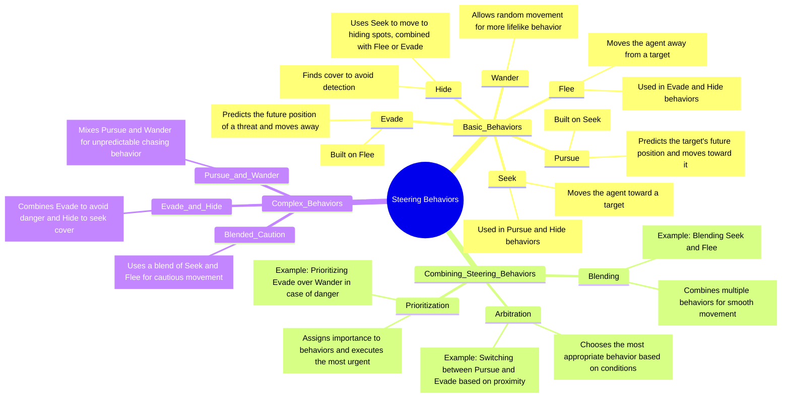

# 🎮 Steering Behaviors in AI for Games

## 📝 Overview

This README introduces **Steering Behaviors** as an essential part of AI in games, focusing on how to build and understand intelligent, lifelike movement for characters. These behaviors combine basic rules to form more complex actions, allowing characters to react naturally to their surroundings.

We'll break down **basic steering behaviors**, explore how to **combine them into more complex systems**, and include an additional focus on the **Hide** behavior, which is useful in stealth mechanics.

## 🧠 Concept Map of Steering Behaviors




## ⚙️ Basic Steering Behaviors

### 1. 🚀 Seek
- **Objective**: Move toward a target.
- **How It Works**: The agent calculates the direction to the target and moves straight toward it.
- **Use Case**: Useful for direct movement such as chasing an enemy.

```csharp
void Seek(Vector3 location) {
    agent.SetDestination(location);
}
```

### 2. 🏃‍♂️ Flee

- Objective: Move away from a target.
- How It Works: The agent calculates the direction opposite to the target and moves in that direction.
- Use Case: Ideal for situations where the character must run away from danger.

```
void Flee(Vector3 location) {
    Vector3 fleeVector = location - this.transform.position;
    agent.SetDestination(this.transform.position - fleeVector);
}
```


### 🔀 Wander
- Objective: Move randomly within a space.
- How It Works: The agent picks random directions to move within a radius, giving it a more natural, lifelike movement.
- Use Case: Adds randomness to character movement, useful for NPCs.

```
void Wander() {
    Seek(targetWorld);
}
```


### 4. 🎯 Pursue
- Objective: Move toward where the target is going to be.
- How It Works: By predicting the target's future position, the agent intercepts the target.
- Use Case: Effective for chasing fast-moving targets.

```
void Pursue() {
    Seek(predictedPosition);
}
```

### 5. ⚡ Evade
- Objective: Move away from where the target is going to be.
- How It Works: Predicts the future location of the threat and avoids it.
- Use Case: Used for defensive maneuvers to avoid capture.

```
void Evade() {
    Flee(predictedPosition);
}
```

### 🛡️ Hide
- Objective: Find cover to avoid detection.
- How It Works: The agent looks for nearby objects to use as cover, positioning itself out of the line of sight of the target.
- Use Case: Crucial for stealth gameplay, where the AI must avoid detection.


```
void Hide() {
    // Calculate the best hiding spot behind a nearby obstacle.
    Vector3 hideSpot = CalculateBestHidingSpot(target, obstacle);
    Seek(hideSpot);
}
```


## 🔄 Combining Steering Behaviors

While individual behaviors are powerful, real-life movement often requires the combination of multiple behaviors to achieve more complex and intelligent actions.

### ⚖️ Blending
- Objective: Smoothly combine two or more behaviors.
- How It Works: By mixing outputs of different steering behaviors, you create a smoother, natural movement. For instance, mixing Seek and Flee based on the distance to a threat.


```
void BlendedSteering() {
    Vector3 blendedDirection = (Seek(target) * 0.7f) + (Flee(threat) * 0.3f);
    agent.SetDestination(blendedDirection);
}
```
### 🔄 Arbitration

- Objective: Choose the best behavior based on the situation.
- How It Works: You assign priority to different behaviors and decide which one takes control depending on game conditions. For example, Flee when close to danger, but Wander when safe.

### ⏫ Prioritization

- Objective: Assign priorities to behaviors to determine which behavior to use.
- How It Works: Certain behaviors take precedence based on game logic. Flee might have higher priority than Seek when danger is near.
