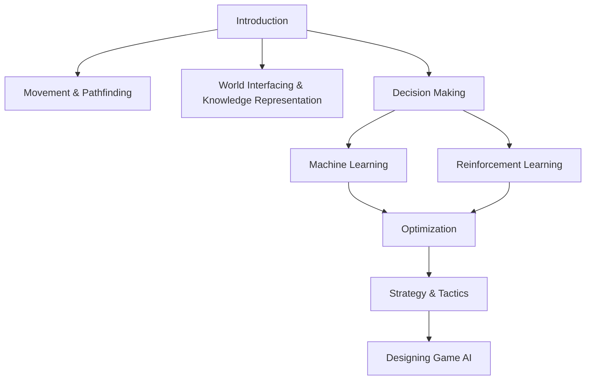

# AI4VJ: Artificial Intelligence for Video Games 🎮🤖

Welcome to the AI4VJ repository, your comprehensive source for learning and mastering artificial intelligence in the video gaming sphere. This course is crafted for students, developers, and gaming aficionados eager to explore the intricate AI techniques that elevate gameplay to new heights.

## What You'll Learn:

### Introduction 🌟
Get started with an overview of AI's role in video games and its revolutionary impact on the industry. Understand the basics of AI, including academic and game AI, and explore a model of game AI.

### Movement & Pathfinding 🚶‍♂️🗺️
Dive into algorithms like A* for sophisticated character navigation and movement. Learn about kinematic and dynamic movement, steering behaviors, and coordinated movement in both 2D and 3D spaces.

### World Interfacing & Knowledge Representation 🌍🧠
Unpack how AI interacts with game environments and handles data. Topics include efficient knowledge retrieval, event management, and sensory systems.

### Decision Making 🤔⚖️
Explore AI decision-making frameworks in dynamic settings. Cover decision trees, state machines, fuzzy logic, and goal-oriented behavior to create intelligent agents.

### Machine Learning 📊🤖
Kickstart your journey with ML models that adapt and evolve within games. Learn about parameter modification, action prediction, and decision learning, including decision tree learning and neural networks.

### Reinforcement Learning 🎲🏆
Engage with hands-on RL applications, covering both foundational techniques and advanced strategies. Understand the basics of RL, Q-learning, and policy gradient methods.

### Optimization ⚙️📈
Learn methods to enhance AI performance and manage resources efficiently. This includes scheduling, anytime algorithms, and level of detail management.

### Strategy & Tactics 🕹️🛡️
Delve into AI methodologies for complex strategic and tactical gameplay. Topics include waypoint tactics, influence maps, and coordinated group actions.

### Designing Game AI 🎨👾
Gain insights into constructing robust and innovative AI systems for game development. Explore the design process for various game genres, from shooters to sports games.

## Features:

- Detailed tutorials and code snippets. 📝
- Interactive Jupyter notebooks for experiential learning. 📚💻
- Installation guides for necessary tools like ML-Agents. 🛠️
- In-depth reviews and case studies, including an analysis of "Killzone’s AI". 🔍🎮
- Quizzes and assessments to gauge your understanding and application of game AI. ✅📝

## Resources:
For a deeper understanding of these topics, you can refer to [Artificial Intelligence for Games by Ian Millington](https://www.elsevier.com/books/artificial-intelligence-for-games/millington/978-0-12-374731-0).

## Diagram:
Below is a flow diagram to help visualize the process of the topics covered in this repository.

